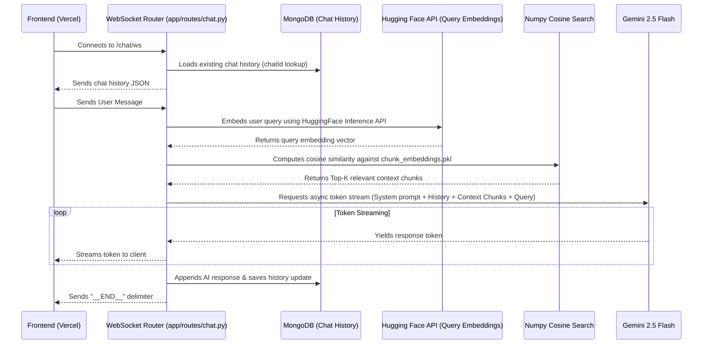

# 🚀 Gaurav's Portfolio Backend (FastAPI + MongoDB RAG)

Welcome to the backend service of Gaurav's Developer Portfolio. This is a high-performance web service built with **FastAPI**, **MongoDB** (using the asynchronous **Motor** driver), and integrated with the **Gemini 2.5 Flash LLM** and a **Hugging Face / local Vector Search RAG system** to power the AI assistant (Yuki-Chan).

---

## 📋 Table of Contents
1. [Project Overview & Key Details](#-project-overview--key-details)
2. [Folder Structure](#-folder-structure)
3. [Architecture & Code Flow](#-architecture--code-flow)
4. [First-Time Installation & Local Development](#-first-time-installation--local-development)
5. [Deployment Guide (Render)](#-deployment-guide-render)
6. [Bugs, Security Gotchas & Critical Points](#-bugs-security-gotchas--critical-points)

---

## 🔍 Project Overview & Key Details

- **Core Framework:** [FastAPI](https://fastapi.tiangolo.com/) (Python)
- **Database:** MongoDB (Asynchronous connectivity via [Motor](https://motor.readthedocs.io/))
- **AI Chatbot (Yuki-Chan):** Streams responses using **Gemini 2.5 Flash** (`google-genai` SDK)
- **RAG System (Retrieval-Augmented Generation):**
  - **Query Embeddings:** Generated via Hugging Face Inference API (`BAAI/bge-small-en-v1.5` or `sentence-transformers/all-MiniLM-L6-v2`)
  - **Vector Similarity:** Calculated locally using `numpy` cosine similarity against pre-computed pickle embeddings (`chunk_embeddings.pkl`) stored in the static profile folder.
- **Routing Modules:** Separate public endpoints (read-only for guests) and admin endpoints (JWT protected for the `/dev-console`).

---

## 📁 Folder Structure

```text
backend/
├── app/
│   ├── core/               # Security utilities, JWT tokens, password hashing
│   │   └── security.py
│   ├── models/             # Schema definitions and data models
│   ├── routes/             # API Router definitions grouped by component
│   │   ├── auth.py         # Login, refresh token, password reset, and OTP verification
│   │   ├── chat.py         # Chatbot WebSocket route (`/ws`)
│   │   ├── skills.py       # CRUD operations for developer skills
│   │   ├── projects.py     # CRUD operations for projects
│   │   └── profile_*.py    # CRUD endpoints for about me, stats, images, and embeddings
│   ├── services/           # External LLM & embedding operations
│   │   ├── llm_gemini.py   # Asynchronous Gemini streaming service
│   │   └── top_chunks.py   # Local vector similarity search & HF query embeddings
│   ├── utils/              # Utility helpers
│   ├── config.py           # Configuration loading
│   ├── database.py         # MongoDB async connection pool & collection index creation
│   └── main.py             # Entrypoint, CORS middleware, & startup lifespan tasks
├── static/                 # Uploaded static files, images, markdown, and pickles
│   ├── uploads/
│   └── profile/
│       ├── aboutme.md      # About Me profile text source
│       └── embeddings/
│           └── chunk_embeddings.pkl  # Pre-computed portfolio context vectors for Yuki-Chan
├── requirements.txt        # Production & Development dependencies
└── .env                    # Local environment variables (do NOT commit to production!)
```

---

## ⚙️ Architecture & Code Flow

### 1. Startup Lifespan (`lifespan` in `app/main.py`)
- FastAPI initializes and runs the async lifespan handler.
- It tests connection to the MongoDB cluster.
- It automatically builds optimized indexes (e.g., compound indexes for categories, skills, and TTL indexes for chat session histories so that sessions expire automatically after 30 days).

### 2. The RAG Chatbot Flow (WebSockets)


---

## 🛠️ First-Time Installation & Local Development

Follow these steps to run the backend on your local machine:

### 1. Prerequisites
- Install **Python 3.10+** (Ensure Python is added to your environment `PATH`).

### 2. Setup Virtual Environment
Open terminal inside the `backend/` directory:

```powershell
# Create virtual environment
python -m venv venv

# Activate Virtual Environment (Windows PowerShell)
.\venv\Scripts\Activate.ps1

# Activate Virtual Environment (Windows CMD)
.\venv\Scripts\activate.bat

# Activate Virtual Environment (Mac/Linux)
source venv/bin/activate
```

### 3. Install Dependencies
```bash
pip install -r requirements.txt
```

### 4. Configure Environment Variables (`.env`)
Create a `.env` file inside the `backend/` directory (refer to the sample below, but **make sure to use your own secure values**):
```env
MONGODB_URI="your_mongodb_atlas_connection_string"
DB_NAME="portfolio"
GEMINI_API_KEY="your_gemini_api_key"
SECRET_KEY="use_secrets_module_to_generate_one"
FRONTEND_URL="http://localhost:3000"
HF_ACCESS_TOKEN="your_huggingface_token"
HF_MODEL_NAME="BAAI/bge-small-en-v1.5"
```

> [!TIP]
> To generate a secure `SECRET_KEY`, run this in your terminal:
> `python -c "import secrets; print(secrets.token_hex(32))"`

### 5. Launch the Development Server
```bash
uvicorn app.main:app --reload
```
Once started, the backend API documentation is interactively accessible at:
- **Swagger UI:** [http://localhost:8000/docs](http://localhost:8000/docs)
- **ReDoc:** [http://localhost:8000/redoc](http://localhost:8000/redoc)

---

## 🌐 Deployment Guide (Render)

Because the backend is deploying to **Render Web Services**, use the following configuration settings:

### 1. Render Environment Settings
Go to your Render Dashboard -> **New Web Service** and configure:
- **Runtime:** `Python 3`
- **Build Command:** `pip install -r requirements.txt`
- **Start Command:** `uvicorn app.main:app --host 0.0.0.0 --port $PORT`

### 2. Environment Variables
Add all keys in your local `.env` to Render's **Environment Variables** panel:
- `MONGODB_URI`
- `DB_NAME`
- `GEMINI_API_KEY`
- `SECRET_KEY`
- `HF_ACCESS_TOKEN`
- `HF_MODEL_NAME` (e.g. `BAAI/bge-small-en-v1.5`)
- `FRONTEND_URL` -> Set this to your production Vercel URL (e.g., `https://your-portfolio.vercel.app`) to handle CORS correctly!

### 3. Preventing Cold Starts (Keep Warm Endpoint)
If you deploy on a free Render tier, your service will spin down after 15 minutes of inactivity.
- **The Solution:** A lightweight path `/health` is built-in (`main.py`). This route avoids database or LLM calls.
- **Setup:** Create a free account on [UptimeRobot](https://uptimerobot.com) and configure an **HTTP(s) Monitor** hitting `https://your-backend.onrender.com/health` every **5 minutes** to ensure continuous uptime and zero latency for prospective recruiters.

---

## 🛡️ Resolved Bugs, Security Gotchas & Critical Points

All previously identified critical bugs and vulnerabilities have been fully resolved to ensure seamless production deployment on Render and Vercel:

### 1. Credentials Separated from Git
- **Status:** **RESOLVED**
- **Detail:** All production credentials are read directly from system environment variables via `python-dotenv` and `os.getenv`. The local `.env` configuration file is ignored by git inside `.gitignore`.

### 2. Static Vector Embedding Import Crash
- **Status:** **RESOLVED** (in [top_chunks.py](file:///d:/Desktop/Personal%20Projects/New%20Portfolio/backend/app/services/top_chunks.py))
- **Detail:** Replaced global module-level embedding loading with a lazy-loading cached function `get_embeddings_data()`. If `chunk_embeddings.pkl` is missing during startup or initial deployment build stages, the server logs a warning and initializes an empty vector search gracefully instead of crashing.
- **Bonus:** The cached loader monitors file modification time (`os.path.getmtime`), allowing dynamic updates when new vector pickles are uploaded via the admin console without needing a server restart!

### 3. OTP Expiration and Manual Visibility
- **Status:** **RESOLVED** (in [auth.py](file:///d:/Desktop/Personal%20Projects/New%20Portfolio/backend/app/routes/auth.py))
- **Detail:**
  - Added a strict 10-minute expiry time (`expires_at`) to password reset requests.
  - Implemented timezone-aware expiry checks during `/verify-otp`. Invalid or expired OTPs are now blocked and automatically expunged.
  - Implemented secure stdout/console logging of generated OTPs (`[AUTH] Generated password reset OTP...`). In production without active SMTP credentials, you can safely look up password recovery codes directly in the **Render Log Dashboard**.