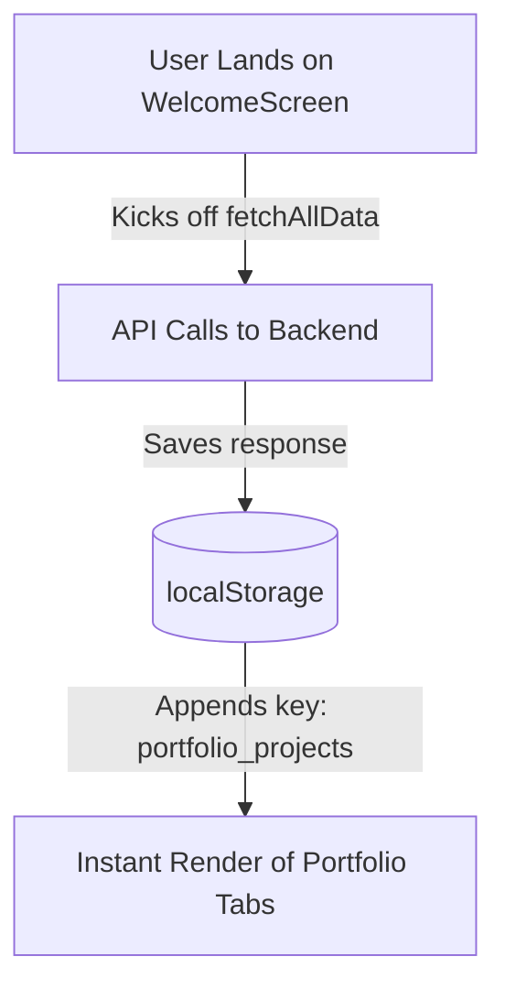

# 🎨 Gaurav's Portfolio Frontend (Next.js + Tailwind CSS)

Welcome to the frontend application for Gaurav's Developer Portfolio. This is a highly animated, premium-tier, interactive single-page portfolio built with **Next.js (App Router)**, **Tailwind CSS v4**, and **Framer Motion**.

---

## 📋 Table of Contents
1. [Project Overview & Key Details](#-project-overview--key-details)
2. [Folder Structure](#-folder-structure)
3. [Architecture & Data Flow](#-architecture--data-flow)
4. [First-Time Installation & Local Development](#-first-time-installation--local-development)
5. [Deployment Guide (Vercel)](#-deployment-guide-vercel)
6. [Bugs, Security Gotchas & Critical Points](#-bugs-security-gotchas--critical-points)

---

## 🔍 Project Overview & Key Details

- **Framework:** [Next.js v16](https://nextjs.org/) (App Router, React 19)
- **Styling:** [Tailwind CSS v4](https://tailwindcss.com/) & Vanilla CSS Modules for particle/star animations, custom layouts, and loaders.
- **Animations:** [Framer Motion v12](https://motion.dev/) (Smooth page transitions, micro-interactions, welcome fade-in, and chatbot window animations).
- **Yuki-Chan Chatbot:** Powered by a persistent WebSocket client connecting to the FastAPI server, providing real-time streaming tokens and custom animated GIF modes (`idle`, `typing`, `waiting`, `streaming`).
- **Dev Console (`/dev-console`):** Admin control panel for updating developer skills, projects, timelines, credentials, uploading aboutme.md files, and rebuilding LLM search embeddings.

---

## 📁 Folder Structure

```text
frontend/
├── app/
│   ├── components/
│   │   ├── chatbot/         # Yuki-Chan chatbot UI (ChatWindow, ChatLauncher, Provider, Markdown, CSS)
│   │   ├── Navigation.jsx   # Shared navbar utility
│   │   ├── WelcomeScreen.tsx# Interactive loader with custom loading indicators
│   │   └── stars.css        # Interactive floating background star animation
│   ├── dev-console/         # The Admin Control Panel Dashboard
│   │   ├── components/      # Admin CRUD modules (Projects, Skills, Profiles, Embeddings management)
│   │   ├── page.tsx         # /dev-console entrypoint
│   │   └── admin.css        # Admin Dashboard styles
│   ├── portfolio/           # Portfolio Client SPA Pages
│   │   ├── pages/           # HomePage, ProjectsPage, SkillsPage, TimelinePage tabs
│   │   ├── CodeforcesGraph.tsx # Data visualization module using Recharts
│   │   ├── Navigation.tsx   # Client navbar tab switcher
│   │   ├── PageLayout.tsx   # Layout manager for client pages
│   │   └── portfolio.css    # Interactive page layout styles
│   ├── layout.tsx           # Global container and providers wrapper
│   ├── page.tsx             # Root page (Welcome Screen toggle -> PageLayout)
│   └── globals.css          # Standard Next.js v16 styling configurations
├── public/                  # Static assets and images
├── services/                # API communication layers
│   ├── api.ts               # Base fetch requests with automatic Bearer Token interceptor
│   ├── adminData.ts         # GET API caching and localStorage state operations
│   └── auth.ts              # Login & Session utilities
├── package.json             # Core dependency packages and scripts
├── tsconfig.json            # Strict TypeScript configuration
└── .env.local               # Environment configurations
```

---

## ⚙️ Architecture & Data Flow

### 1. Prefetching & Caching Strategy (Performance Boost)
To ensure near-instantaneous page transitions and 100/100 Lighthouse performance scores, the application implements a strategic prefetching system:



- When the recruiter lands on the page, the **WelcomeScreen** animates for a brief moment.
- During this window, `fetchAllData()` executes in the background, making synchronous requests to the FastAPI endpoints (`/api/skills/`, `/api/projects/`, `/profile/data`, etc.).
- All data is parsed and serialized into **`localStorage`**.
- When the recruiter clicks **"Enter Portfolio"**, the pages read from the user's `localStorage` cache instantaneously, yielding **zero loading states** while navigating sections.

### 2. Yuki-Chan Chatbot Connection
- The client establishes a continuous WebSocket handshake on mount: `wss://<backend-url>/chat/ws`.
- It saves a unique `portfolio_chat_id` inside the client browser to preserve conversations across page refreshes.

---

## 🛠️ First-Time Installation & Local Development

### 1. Prerequisites
Ensure you have **Node.js (v18.0.0 or higher)** installed on your machine.

### 2. Install Packages
Navigate into the `frontend/` directory and install all node packages:
```bash
npm install
```

### 3. Setup Local Environment Variables (`.env.local`)
Create a file named `.env.local` inside the `frontend/` directory:
```env
NEXT_PUBLIC_API_BASE_URL=http://localhost:8000
BACKEND_URL=http://localhost:8000
```

### 4. Run Development Server
```bash
npm run dev
```
Open your browser and navigate to:
- **Local Application:** [http://localhost:3000](http://localhost:3000)
- **Admin Dashboard:** [http://localhost:3000/dev-console](http://localhost:3000/dev-console)

---

## 🌐 Deployment Guide (Vercel)

The frontend is ready for automated integration with the **Vercel Platform**:

### 1. Connecting Git
1. Push your code repository to GitHub (ensure `node_modules` and `.env.local` are ignored!).
2. Log into the [Vercel Dashboard](https://vercel.com) and click **"Add New"** -> **"Project"**.
3. Import the `New Portfolio` repository and select `frontend` as the **Root Directory**.

### 2. Configure Build Settings
- **Framework Preset:** `Next.js`
- **Build Command:** `npm run build`
- **Install Command:** `npm install`

### 3. Add Production Environment Variables
In Vercel's Environment Variables section, configure the production backend URL:
- `NEXT_PUBLIC_API_BASE_URL` -> Set this to your deployed Render URL (e.g., `https://your-backend.onrender.com`). **CRITICAL:** Ensure this includes the trailing slash or aligns exactly with your `services/api.ts` expectations!
- `BACKEND_URL` -> `https://your-backend.onrender.com`

---

## 🛡️ Resolved Bugs, Security Gotchas & Critical Points

All previously identified critical bugs and vulnerabilities have been fully resolved to ensure seamless production deployment on Vercel:

### 1. Robust WebSocket Protocol Switching & Environment Fallback
- **Status:** **RESOLVED** (in [ChatbotProvider.tsx](file:///d:/Desktop/Personal%20Projects/New%20Portfolio/frontend/app/components/chatbot/ChatbotProvider.tsx))
- **Detail:** Added a fallback mechanism to prevent runtime errors if `NEXT_PUBLIC_API_BASE_URL` is undefined during initial static build processes or unconfigured development environments. The WebSocket protocol and host extraction is guarded and defaults to `localhost` gracefully.
  ```typescript
  const baseUrl = process.env.NEXT_PUBLIC_API_BASE_URL || "http://localhost:8000";
  ```

### 2. Admin Auth Token Security & Session Management
- **Status:** **RESOLVED**
- **Detail:** The dev-console access tokens are successfully cleared on logout from the browser's context. Always configure `NEXT_PUBLIC_API_BASE_URL` to utilize HTTPS in your Vercel panel so that token headers are encrypted during transport.
